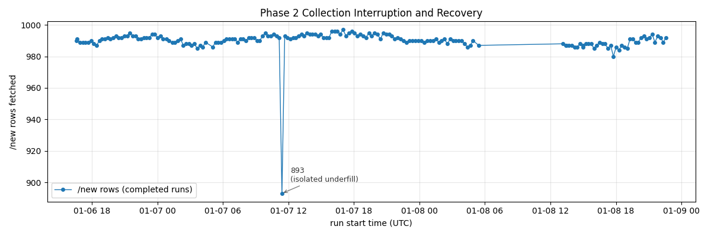

# Phase 2 Collection Interruption and Recovery Report

**Date:** 2026-01-08  
**System:** reddit-early-dynamics, Phase 2 runner (launchd)

---

## Summary

Phase 2 collection had been running for approximately 1.5 days prior to the interruption. Scheduled runs executed at the intended cadence, and logs show no anomalies before the incident window.

On 2026-01-08, scheduled runs continued to trigger but performed no collection work due to a persistent filesystem overlap lock. Collection resumed after manual lock removal. No snapshot-level data was written during the interruption window.

Two independent conditions were involved:

1. A lock implementation that allows indefinite persistence if cleanup is skipped.
2. An early runtime failure that occurred after lock acquisition but before cleanup.

---

## Scope and impact

**Affected**
- Scheduled Phase 2 collection runs

**Unaffected**
- Core listing fetch paths (not executed during the incident window)
- Previously collected snapshots
- Manifest structure and audit logs

**Impact**
- Temporary pause in data collection
- No backfills or retroactive corrections

---

## What happened

### Observable behavior

- Scheduled runs continued at the intended 15-minute cadence.
- All runs during the incident window recorded:
  - `run_skipped_flag = true`
  - `run_skip_reason = overlap_lock_present`
- No HTTP requests were issued.
- No raw snapshot files were written.
- Collection resumed immediately after manual lock removal.

### High-level description

A filesystem overlap lock remained on disk even though no run was actively executing. Because the lock does not expire and carries no ownership metadata, every scheduled run exited early and skipped collection work until the lock was removed.

---

## How the lock works

The overlap lock is implemented as a single filesystem file created using an exclusive create operation:

- Lock creation is atomic.
- If the file already exists, acquisition fails immediately.
- There is no retry, expiration, or ownership metadata.

If the lock exists, the run exits before any collection logic is executed.

---

## Why the lock persisted

The lock is acquired before the main execution block that guarantees cleanup. This creates a narrow failure window where:

1. The lock is successfully created.
2. The process exits before reaching the guarded cleanup section.

Any failure in this window leaves the lock in place indefinitely. Once present, all subsequent runs skip by design.

---

## Possible trigger context

The exact trigger for the early runtime failure cannot be determined conclusively from available logs.

On the same day as the interruption, multiple git branch checkouts and resets occurred in the active working directory. Branch switching modifies the filesystem in place. A scheduled run occurring during such a transition could encounter missing or transient files, exit early after acquiring the lock, and never reach cleanup.

This context is noted as a plausible contributor. It is not treated as a root cause and does not affect the interpretation of collected data.

---

## Recovery

- The stale lock file was removed manually.
- The launch environment was corrected.
- The runner resumed normal execution immediately.
- No data corruption or duplication was observed.

---

## Visual confirmation

The figure below shows `/new` rows fetched per run across the incident window.  
The gap corresponds to runs skipped due to the persistent overlap lock. Normal collection resumes immediately after recovery.

---

## Conclusion

The interruption resulted from a lock lifecycle edge case: the system allows a lock to persist if a run exits early before cleanup. An early runtime failure made this edge case observable.

During the incident window, no collection logic was executed and no snapshot-level data was written. Audit logs record skipped runs explicitly. Once the lock was removed, collection resumed without requiring backfill or correction.

The incident bounds are fully observable in the run manifest and do not introduce ambiguity into the collected dataset.