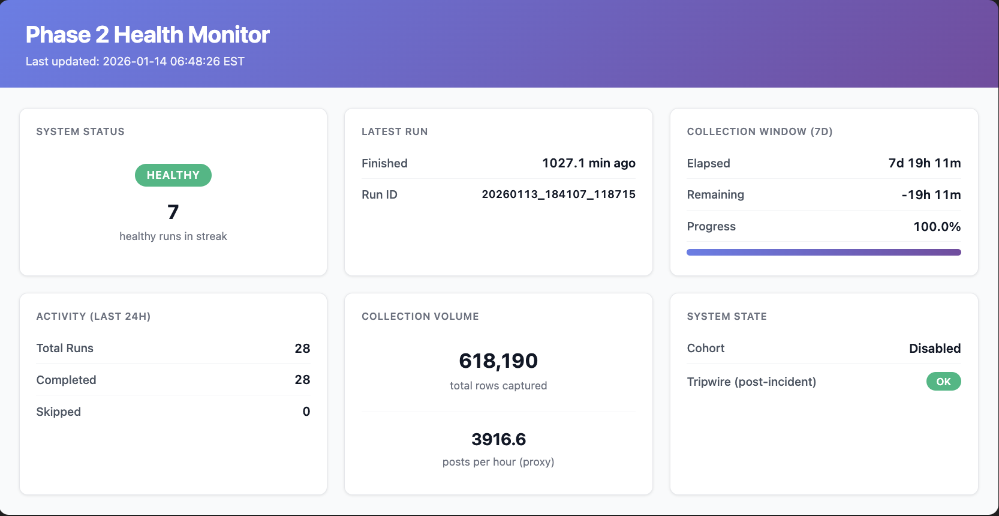
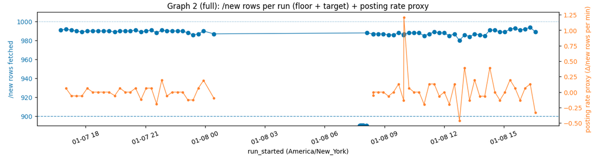

# Phase 2 Collection Interruption

## Operational Case Study

**System:** reddit-early-dynamics, Phase 2 runner  
**Date of interruption:** 2026-01-08  
**Collection cadence:** 15-minute scheduled runs  
**Data source:** Append-only run manifest

---

## Summary

During Phase 2 data collection, scheduled runs continued at the intended cadence but stopped ingesting data due to a persistent execution lock. The issue was detected through manifest-based monitoring and resolved without data loss or duplication.

---

## Monitoring & Detection

Ingestion health was monitored using a manifest-driven dashboard built from the append-only run manifest.

The dashboard tracked:

- Run cadence
- Completed vs skipped runs
- HTTP calls per run
- New rows captured per run
- Run duration
- Healthy run streak

A disruption was visible in run-level metrics, including a drop in new rows captured and repeated skip states.

The interruption window was clearly observable in operational metrics prior to investigation.

---

## Root Cause

Analysis determined that an execution lock persisted after an early process exit, causing subsequent scheduled runs to skip ingestion work.

The system failed safely (no partial writes), and all skipped runs were recorded in the manifest.

---

## Recovery & Controls

- Stale execution lock removed.
- Scheduled ingestion resumed immediately.
- No backfill required.
- Post-incident monitoring safeguards implemented.

---

## Outcome

- Data integrity preserved
- No duplication or corruption
- Stable cadence restored
- Monitoring framework validated.
